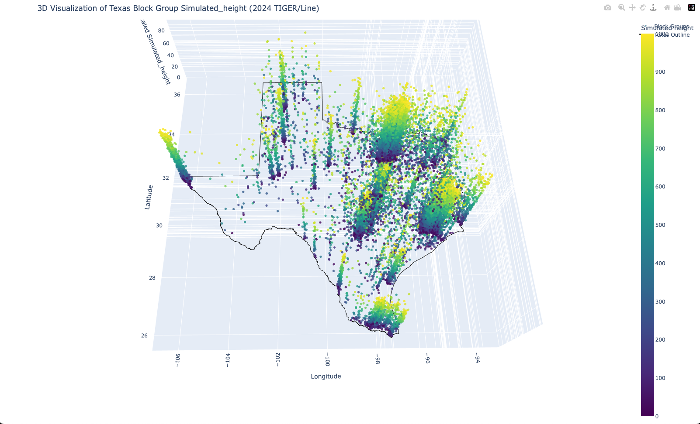

# Texas Population Peaks 🗺️

An interactive 3D visualization of Texas population density using Census Block Group data. This project transforms demographic data into a beautiful, explorable landscape where population density creates peaks and valleys across Texas.

[View Live Demo](https://YOUR_USERNAME.github.io/texas-population-peaks)



## Features ✨

- **Interactive 3D Visualization**: Explore Texas population data in a fully interactive 3D environment
- **Dynamic Color Gradients**: Beautiful color transitions from cool to warm colors representing population density
- **Terrain Effects**: Underlying terrain adds depth and context to the visualization
- **High Resolution**: 75x75 grid for smooth terrain representation
- **Responsive Design**: Clean, modern UI that works across devices
- **Rich Data Display**: Hover over any point to see detailed population information

## Installation 🚀

1. Clone the repository:
```bash
git clone https://github.com/YOUR_USERNAME/texas-population-peaks.git
cd texas-population-peaks
```

2. Create and activate a virtual environment:
```bash
python -m venv venv
source venv/bin/activate  # On Windows, use: venv\Scripts\activate
```

3. Install dependencies:
```bash
pip install -r requirements.txt
```

## Usage 🎮

1. Run the visualization script:
```bash
python texas_peaks.py
```

2. Open `texas_population_peaks.html` in your web browser to view the visualization.

### Interactive Controls 🕹️

- 🔄 Click and drag to rotate the view
- 🔍 Scroll to zoom in/out
- ✋ Right-click and drag to pan
- 👆 Double-click to reset the view
- ℹ️ Hover over points for detailed information

## Data Source 📊

This visualization uses the 2024 TIGER/Line Shapefiles from the U.S. Census Bureau:
- Block Group level data for Texas
- Population and land area statistics
- Geographic boundaries and coordinates

## Technical Details 🛠️

### Dependencies
- geopandas: Geospatial data handling
- plotly: Interactive visualization
- numpy: Numerical computations
- pandas: Data manipulation
- requests: Data download

### Key Features Implementation
- **Wave Patterns**: Multiple sinusoidal functions create natural-looking terrain
- **Color Gradients**: Custom HSV to RGB color mapping for intuitive density representation
- **Terrain Generation**: Beta distribution for realistic terrain noise
- **Enhanced UI**: Custom HTML/CSS wrapper for better user experience

## Deployment 🌐

### Local Development
1. Make your changes
2. Test locally by running `python texas_peaks.py`
3. Open the generated HTML file in a browser

### GitHub Pages Deployment
1. Push your changes to GitHub
2. Enable GitHub Pages in your repository settings
3. Set the source to the main branch
4. Your visualization will be available at `https://YOUR_USERNAME.github.io/texas-population-peaks`

## Contributing 🤝

Contributions are welcome! Please feel free to submit a Pull Request.

1. Fork the repository
2. Create your feature branch (`git checkout -b feature/AmazingFeature`)
3. Commit your changes (`git commit -m 'Add some AmazingFeature'`)
4. Push to the branch (`git push origin feature/AmazingFeature`)
5. Open a Pull Request

## License 📝

This project is licensed under the MIT License - see the [LICENSE](LICENSE) file for details.

## Acknowledgments 🙏

- U.S. Census Bureau for providing the TIGER/Line Shapefiles
- Plotly for the interactive visualization library
- GeoPandas for geospatial data handling 